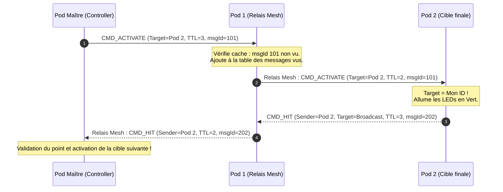
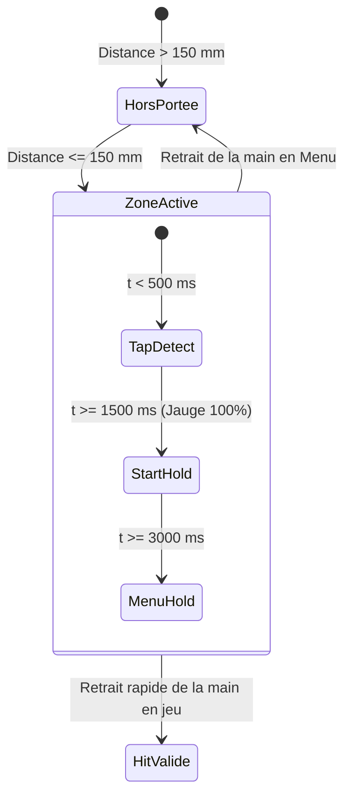
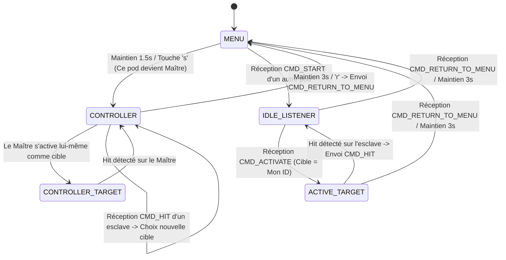

# Architecture Système & Spécifications Techniques — Light Trainer V3

Ce document décrit en détail l'architecture matérielle, logicielle, réseau et énergétique du système **Light Trainer V3**.

---

## 1. Vue d'Ensemble du Système

Le **Light Trainer** est un écosystème de pods lumineux interactifs et autonomes destinés à l'entraînement sportif (réactivité, agilité, vitesse de décision).

```mermaid
graph TD
    User["Utilisateur / Sportif"] -->|Geste / Frappe sans contact| ToF["Capteur ToF VL53L0X (I2C)"]
    ToF -->|Interruption / Distance mm| ESP["Microcontrôleur Seeed XIAO ESP32-C3"]
    ESP -->|Signal Data D7 (GRB)| LEDs["Anneau 7 LEDs WS2812B"]
    ESP -->|ESP-NOW Mesh Flooding (2.4 GHz)| Peer["Autres Pods Light Trainer"]
    ESP -->|WiFi SoftAP + Web Server| Smartphone["Interface Web Config (Mobile/PC)"]
    
    Battery["Batterie LiPo 3.7V"] -->|BAT+ / BAT-| Charger["Chargeur Linéaire Intégré (USB-C)"]
    Battery -->|Pont 100k/100k| ADC["Mesure ADC (D1)"]
    Switch["Interrupteur SPDT (SW1)"] -->|Alimentation 3V3_S| ToF
    Switch -->|Alimentation 3V3_S| LEDs
    Switch -->|Signal D2 (Wakeup)| ESP
    USB["Port USB-C (5V VBUS)"] -->|Pont 100k/200k| ChargePin["Détection Charge (D10)"]
```

---

## 2. Architecture Électrique & Énergie

### 2.1. Étage d'Alimentation et Gestion de Batterie
* **Microcontrôleur** : Seeed Studio XIAO ESP32-C3 (Flash physique 4 Mo, architecture RISC-V 32 bits, 160 MHz).
* **Schéma de Partitionnement Flash** : Nécessite la configuration **`Huge APP (3MB No OTA/1MB SPIFFS)`** dans l'IDE Arduino. L'interface Web complète intégrée en Flash (`PROGMEM`) représentant environ 1.3 Mo de binaire, la table standard de 1.3 Mo déborde sans ce réglage.
* **Batterie** : Accumulateur Lithium-Polymère (LiPo) 3.7 V monocellule (4.2 V max, 3.0 V coupure).
* **Recharge USB-C** : Assurée automatiquement par le contrôleur de charge intégré sous le XIAO ESP32-C3 via les pads `BAT+` et `GND`.

### 2.2. Cartographie des Pins (Pinout V3 / Veroboard)

| Nom Broche | Pin XIAO | GPIO ESP32-C3 | Fonction | Rôle & Caractéristiques |
| :--- | :--- | :--- | :--- | :--- |
| **`BAT_ADC_PIN`** | `D1` | `GPIO3` | Entrée ADC Batterie | Pont diviseur $100\text{ k}\Omega / 100\text{ k}\Omega$ ($V_{\text{batt}} = 2 \times V_{\text{ADC}}$) + C1 $100\text{ nF}$ |
| **`SW_PIN`** | `D2` | `GPIO4` | Détection Switch / Wakeup | Détection $3\text{V}3\_S$ + Réveil Deep Sleep sur front montant |
| **`BUZZER_PIN`** | `D3` | `GPIO5` | Sortie Buzzer (Option) | Sortie PWM pour signaux sonores (TP2) |
| **`SCL_PIN`** | `D4` | `GPIO6` | Bus I2C SCL | Horloge I2C pour VL53L0X (Pull-up $10\text{ k}\Omega$ intégrée au module) |
| **`SDA_PIN`** | `D5` | `GPIO7` | Bus I2C SDA | Données I2C pour VL53L0X (Pull-up $10\text{ k}\Omega$ intégrée au module) |
| **`LED_PIN`** | `D7` | `GPIO20` | Sortie WS2812B Data | Signal série cadencé à 800 kHz pour les 7 LEDs |
| **`CHARGE_PIN`** | `D10` | `GPIO10` | Détection USB 5V VBUS | Pont diviseur $100\text{ k}\Omega / 200\text{ k}\Omega$ ($V_{\text{pin}} = 3.33\text{ V}$) |

### 2.3. Gestion de l'Interrupteur et Mode Veille Profonde (Deep Sleep)
Pour maximiser l'autonomie et supprimer tout courant de fuite sans nécessiter d'interrupteur haute puissance :
1. L'interrupteur à glissière $SW_1$ coupe la ligne $3\text{V}3\_S$ alimentant les périphériques (LEDs et capteur ToF).
2. Lorsque $SW_1$ est basculé sur OFF, la broche `D2` passe à `LOW` (tirée à la masse par la résistance de pull-down $R_3 = 100\text{ k}\Omega$).
3. Le microcontrôleur détecte la transition, éteint la radio WiFi, isole ses GPIOs (`LED_PIN`, `SCL`, `SDA` configurées en haute impédance / pull-down), configure le réveil sur front montant via `esp_deep_sleep_enable_gpio_wakeup(1ULL << D2, ESP_GPIO_WAKEUP_GPIO_HIGH)`, et entre en **Deep Sleep** ($I_{\text{sleep}} \approx 10\text{--}15\,\mu\text{A}$).
4. Le basculement de $SW_1$ sur ON réinjecte $3.3\text{ V}$ sur `D2`, ce qui réveille instantanément le microcontrôleur.

---

## 3. Protocole Réseau & Topologie Mesh ESP-NOW

### 3.1. Philosophie du Réseau
* **Protocole de transport** : ESP-NOW (Protocole propriétaire Espressif sans fil basé sur des trames d'action 802.11 sans association de point d'accès).
* **Canal radio** : Canal 1 fixe verrouillé.
* **Topologie** : Réseau Mesh sans maître fixe prédéfini (*Peer-to-Peer* avec élection dynamique du Master lors du démarrage de partie).

### 3.2. Format de la Trame Radio (`struct_message`)
La trame est compactée sur 28 octets pour garantir une latence d'émission inférieure à 2 ms :

```cpp
typedef struct __attribute__((packed)) struct_message {
  uint32_t msgId;     // Identifiant unique incrémental pour le filtrage anti-boucle
  uint64_t senderID;  // Adresse MAC unique du pod expéditeur (64 bits)
  uint64_t targetID;  // ID du pod cible (0 = BROADCAST à tous, sinon MAC ciblée)
  uint8_t  msgType;   // Type de commande (MsgType)
  uint8_t  ttl;       // Time-To-Live (nombre de sauts restants, défaut = 3)
  uint32_t color;     // Couleur RGB associée OU données de télémétrie compactées
} struct_message;
```

#### Commandes Réseau (`enum MsgType`) :
| Valeur | Nom | Rôle & Charge Utile |
| :--- | :--- | :--- |
| `0` | **`CMD_START`** | Ordre de début de partie émis par le Master vers la flotte. |
| `1` | **`CMD_ACTIVATE`** | Activation d'un pod spécifique (ou broadcast). `color` contient le code RGB. |
| `2` | **`CMD_HIT`** | Signal de frappe émis par l'esclave touché vers le Master. |
| `3` | **`CMD_PING`** | Requête de mesure de portée, latence RTT et force de signal ($RSSI$). |
| `4` | **`CMD_ACK`** | Réponse immédiate de l'esclave au ping avec horodatage. |
| `5` | **`CMD_RETURN_TO_MENU`** | Ordre d'arrêt synchronisé de la partie et réinitialisation en mode Menu. |
| `6` | **`CMD_MANUAL_SET`** | Ordre du coach via l'interface Web pour forcer l'allumage manuel d'un pod. |
| `7` | **`CMD_TEST_LEDS`** | Déclenchement d'un banc de test visuel sur les 7 LEDs d'un pod distant. |
| `8` | **`CMD_POD_TELEMETRY`** | Diffusion périodique (toutes les 5 s) de l'état de batterie et de charge. |

#### Encapsulation de Télémétrie sur 32 bits (`CMD_POD_TELEMETRY`) :
Pour éviter de gonfler la taille du paquet radio, les informations de santé du pod sont encapsulées dans le champ 32 bits `color` :
* **Bits 0 à 7** (`color & 0xFF`) : Pourcentage de batterie restant (`batPct`, $0\text{--}100\,\%$).
* **Bits 8 à 23** (`(color >> 8) & 0xFFFF`) : Tension batterie en centièmes de Volt ($V_{\text{batt}} \times 100$, ex: $412 = 4.12\text{ V}$).
* **Bit 24** (`(color >> 24) & 0x01`) : Statut de charge USB (`isCharging`, $1$ si branché sur $5\text{V}$, $0$ sur batterie).

---

### 3.3. Algorithme de Routage Mesh (Flooding avec Déduplication)


---

### 3.4. Gestion de Présence de la Flotte (Node Liveness, Sommeil & Élagage)
* **Battement de Cœur (Heartbeat / Discovery)** : Chaque pod diffuse son paquet `CMD_POD_TELEMETRY` toutes les $5\text{ s}$ (`DISCOVERY_INT`).
* **Détection de Veille / Déconnexion ($12\text{ s}$)** :
  - Tout pod distant dont la dernière trame reçue remonte à plus de $12\text{ secondes}$ (`millis() - node.lastSeen > 12000`) est immédiatement qualifié hors-ligne (`online = false`).
  - Dans l'interface Web (Mode Manuel et Diagnostic), il est grisé avec la mention *"💤 En veille"*.
  - **Protection du Moteur de Jeu** : La méthode `GameNetwork.getKnownNodes()` filtre strictement les pods inactifs. Le moteur de jeu ne sélectionnera jamais un pod endormi comme cible !
* **Élagage Automatique (Pruning à $60\text{ s}$)** :
  - Si un pod reste silencieux pendant plus de $60\text{ secondes}$, il est supprimé de la table des nœuds connus dans `GameNetwork.update()` afin de libérer de l'espace pour de nouveaux pods sans saturation mémoire.

---

## 4. Moteur Gestuel & Détection Optique ToF (VL53L0X)

Le capteur de distance laser à temps de vol (Time-of-Flight) VL53L0X est configuré en mode **`HIGH_SPEED`** à 50 Hz (cycle de 20 ms) pour une réactivité sportive instantanée sans contact.



### Paramètres de Détection
* **Seuil de frappe (`TOF_TRIGGER_DISTANCE`)** : $150\text{ mm}$ (détection fiable de la main sans toucher physiquement le pod).
* **Tap Court (`GESTURE_TAP_MAX_MS`)** : $< 500\text{ ms}$ (changement de mode de jeu en Menu).
* **Maintien Démarrage (`GESTURE_START_HOLD_MS`)** : $1500\text{ ms}$ avec jauge visuelle circulaire.
* **Maintien Retour Menu (`GESTURE_MENU_HOLD_MS`)** : $3000\text{ ms}$ pour réinitialiser tout le système.
* **Tolérance aux micro-décrochages (`GESTURE_GLITCH_TOLERANCE_MS`)** : $250\text{ ms}$ (évite d'annuler le maintien en cas de vibration ou ombre).

---

## 5. Machine à États Logicielle (Game Engine)



---

## 6. Architecture Web Embarquée, Streaming Zero-Copy & Portail Captif

### 6.1. Streaming HTTP Zero-Copy depuis la Flash (`PROGMEM`)
L'interface Web complète du Light Trainer (HTML5, SVG vectoriels, styles CSS modernes, scripts d'animation et moteur de graphes) représente environ 75 Ko de code source.
* **Problématique de la mémoire RAM (Heap)** : Dans l'environnement Arduino ESP32, instancier une `String` de 75 Ko ou concaténer de gros buffers entraîne une fragmentation sévère du tas (Heap). Le serveur Web échoue alors à allouer le buffer contigu nécessaire et renvoie un en-tête `Content-Length: 0`, provoquant une page blanche ou le blocage du portail captif.
* **Solution Zero-Copy (`server.send_P`)** :
  - La chaîne complète est déclarée en mémoire Flash constante : `static const char DASHBOARD_HTML[] PROGMEM = R"rawliteral(...)rawliteral";`.
  - Le serveur Web utilise la méthode zero-copy : `server.send_P(200, "text/html", DASHBOARD_HTML, sizeof(DASHBOARD_HTML) - 1);`.
  - Le microcontrôleur lit directement la Flash via le bus MMU et transmet les octets par paquets réseau MTU (1460 octets) sans jamais allouer la page en RAM !

### 6.2. Portail Captif Haute Résilience
Pour garantir l'ouverture automatique du tableau de bord lors de la connexion WiFi sur iOS, Android, Windows et macOS :
1. **Serveur DNS Wildcard (Port 53 UDP)** : Toutes les requêtes de résolution de noms de domaine sont interceptées et redirigées vers l'IP locale `192.168.4.1`.
2. **Codes d'Erreur DNS (`NoError`)** : Configuration explicite de `dnsServer.setErrorReplyCode(DNSReplyCode::NoError)` afin de ne pas rejeter les requêtes modernes AAAA (IPv6) ou HTTPS (Type 65) qui feraient abandonner le système d'exploitation mobile.
3. **Interception des Sondes Dédiées OS** :
   - Apple iOS / macOS : `/hotspot-detect.html`, `/canonical.html`
   - Android / ChromeOS : `/generate_204`, `/gen_204`
   - Windows 10/11 : `/connecttest.txt`, `/ncsi.txt`
   - Firefox / Linux : `/success.txt`, `/library/test/success.html`
4. **Gestion des Redirections 302** : Toute URI inconnue non préfixée par `/api/` renvoie un code HTTP `302 Redirect` vers `http://192.168.4.1/` avec un corps textuel d'accompagnement pour satisfaire les clients stricts.

