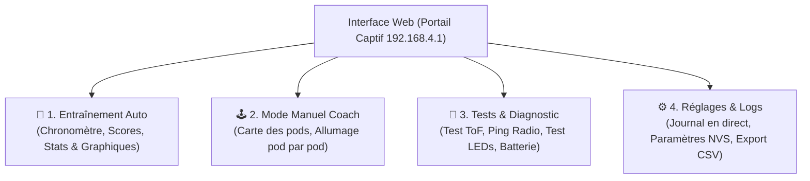

# Spécifications & Architecture Détaillée : Dashboard Web & Portail Captif V3

Ce document formalise la conception complète du portail captif et de l'interface Web du **Light Trainer V3**.

---

## 🧭 1. Vue d'Ensemble des 4 Espaces de l'Interface Web

L'application s'articule autour de **4 onglets ergonomiques** :



---

## 📱 2. Détail des Fonctionnalités par Onglet

### 🎯 Onglet 1 : Mode Jeu / Entraînement Automatique
* **Chronomètre & Télécommande** : Grand affichage numérique avec boutons `[Démarrer]`, `[Pause]`, `[Stop]`.
* **Sélection du Mode Sportif** :
  * Mode 0 : Vitesse Solo (1 Couleur, sans délai)
  * Mode 1 : Duel 2 Joueurs (Bicolore Rouge vs Vert, sans délai)
  * Mode 2 : Réflexe Aléatoire (1 Couleur avec délai variable)
  * Mode 3 : Agilité Cognitive (Alternance 2 Couleurs avec délai variable)
  * Mode 4 : Jeu Simon (Mémoire séquentielle & accélération progressive)
* **Statistiques Live & Cartes Dynamiques** :
  * *Vue Duel* : Comparaison en direct Joueur 1 vs Joueur 2, temps moyen, record et barre de domination proportionnelle.
  * *Vue Simon* : Badge d'état (Démonstration / À vous / Succès / Game Over), Tour actuel, Longueur de séquence, Record de la session, Progression étape par étape et Vitesse tempo ($ms$).
  * *Synthèse Globale* : Total de touches, Cadence ($BPM$), Temps moyen ($ms$), Meilleur record ($ms$).
* **Graphique Haute Précision Auto-Adaptatif** : Tracé vectoriel lissé avec axe $Y$ dynamique (adapté aux temps $> 500\text{ ms}$) et ligne de moyenne pointillée.

---

### 🕹️ Onglet 2 : Mode Manuel (Contrôle Direct par le Coach)
* **Visualisation de la Grille des Pods & Suivi de Présence** :
  * Le compteur d'en-tête affiche la proportion de pods actifs : ex. `1/3 Pods` si 2 pods sont en veille ou éteints.
  * Chaque pod découvert dans le réseau maillé apparaît sous forme de carte interactive :
    * Nom / ID du pod (`Pod 1 (Master)`, `Pod 2`, `Pod 3`...)
    * Niveau de batterie ($V$ et $\%$) et icône de charge USB `⚡`
    * Force du signal radio ($RSSI$ en $dBm$)
    * Statut actif (Cible en cours avec liseré vert fluo)
  * **Gestion Visuelle des Pods en Veille (Deep Sleep)** :
    * Tout pod silencieux depuis $>12\text{ s}$ est automatiquement détecté hors-ligne.
    * Sa carte passe en mode estompé (`opacity: 0.38`), l'avatar adopte une bordure en pointillés, et la mention *"💤 En veille (Xs)"* apparaît.
    * Les clics sont désactivés pour éviter d'envoyer des commandes infructueuses dans le vide.
* **Contrôle Tactile Instantané** :
  * Palette de couleurs rapides : 🟢 Vert, 🔴 Rouge, 🔵 Bleu, 🟡 Jaune, 🟣 Magenta, ⚪ Blanc.
  * **Clic sur un Pod Actif** : Le coach clique sur le Pod #2 $\rightarrow$ le pod #2 s'allume immédiatement de la couleur choisie.
  * **Boutons globaux** : `[Tout Allumer]`, `[Tout Éteindre]`, `[Flash Général]`.
* **Détection de frappe en mode manuel** : Lorsqu'un athlète frappe le pod allumé, le pod s'éteint et la page Web émet un signal sonore/visuel avec le temps écoulé depuis l'allumage par le coach !

---

### 🧪 Onglet 3 : Banc de Tests & Diagnostics en Direct
Permet à l'utilisateur de vérifier l'état du matériel en 1 coup d'œil sans démonter :

| Composant | Outil de Diagnostic Intégré | Ce que l'utilisateur voit à l'écran |
| :--- | :--- | :--- |
| **Capteur ToF** | Testeur de Distance Temps Réel | Jauge dynamique indiquant la distance exacte en $mm$ et détection d'obstacle (Vert si $< 150\text{ mm}$, indicateur d'erreurs optiques/soleil). |
| **Réseau Radio** | Outil Ping & Portée Actif | Bouton `[Tester la liaison]` : Envoie des pings (`CMD_PING`) vers chaque pod distant via ESP-NOW, mesure et affiche le temps de réponse (RTT en $ms$) et la force du signal ($RSSI$ en $dBm$). |
| **LEDs WS2812B** | Séquenceur de Test LED | Boutons de test rapide : Cycle RGB, Blanc $100\%$ (test de puissance), Chenillard circulaire (test des 7 LEDs individuelles). |
| **Alimentation Flotte** | Tableau de Batterie Global | Section dédiée **"Batterie de toute la flotte"** : Cartes individuelles pour le Master et tous les esclaves avec tension en direct ($V$), jauge colorée ($\%$, alerte rouge si $\le 20\%$), badge de charge USB (`⚡ Charge USB`), et statut hors-ligne/veille. |

---

### ⚙️ Onglet 4 : Réglages, Logs Système & Exportation

#### A. Journal d'Événements en Direct (Console de Logs)
* Fenêtre de log déroulante (type terminal) affichant tous les événements système horodatés :
  ```text
  [12:04:15.120] [RADIO] Nouveau pod découvert : Pod #2 (MAC: E0:5A:1B:77:88:99) RSSI: -52 dBm
  [12:04:18.450] [GAME] Démarrage du Mode 0 (Vitesse Solo)
  [12:04:19.230] [HIT] Pod #2 touché ! Temps de réaction : 215 ms
  [12:04:20.100] [TOF] Mesure : 112 mm (Main détectée)
  [12:04:25.800] [POWER] Tension batterie Pod Master : 4.12V (95%)
  ```
* Filtres de logs : `Tous`, `Erreurs`, `Radio`, `Jeu`, `Batterie`.
* Bouton `[Effacer les logs]` et `[Copier les logs]`.

#### B. Paramètres Système (Sauvegardés en Flash NVS)
* Curseur de luminosité globale des LEDs ($10\%$ à $100\%$).
* Éditeur de couleurs des modes de jeu (Color Picker).
* Réglage des délais aléatoires min/max entre cibles.
* Seuil de déclenchement ToF (ajustable de $50\text{ mm}$ à $300\text{ mm}$).

#### C. Export des Données (CSV)
* Bouton `[Télécharger la séance (CSV)]` : Télécharge le fichier structuré de la session directement sur le smartphone pour analyse dans Excel / Google Sheets.

---

## ⚡ 3. Architecture Logicielle & Coexistence Radio

```mermaid
flowchart TD
    subgraph ESP32["Seeed Studio XIAO ESP32-C3"]
        subgraph ModeAP["Interface SoftAP (192.168.4.1)"]
            DNS["Serveur DNS Captif (Port 53)<br/>Redirection globale"]
            HTTP["Serveur Web HTTP (Port 80)"]
            REST["Endpoints REST API (JSON)"]
        end

        subgraph ModeSTA["Interface STA (Canal 1 fixe)"]
            ESPNOW["ESP-NOW Mesh Flooding<br/>(Zéro latence avec les pods)"]
        end

        subgraph Core["Moteur de Jeu & Logique"]
            GameEngine["Game Engine (Auto / Manuel)"]
            LogBuffer["Buffer Circulaire de Logs (RAM)"]
            HitHistory["Historique des Frappes (RAM)"]
            HardwareMgr["Hardware (ToF 50Hz, LEDs, ADC)"]
        end

        DNS --> HTTP
        HTTP --> REST
        REST <--> GameEngine
        REST <--> LogBuffer
        REST <--> HitHistory
        GameEngine <--> ESPNOW
        GameEngine <--> HardwareMgr
    end

    Phone["Smartphone / Tablette (Portail Captif)"] <-->|Requêtes HTTP / JSON (Poll 250ms)| HTTP
```

---

## 🔌 4. Spécification des Endpoints API REST (JSON)

| Méthode & Route | Description | Exemple de Données Échangées |
| :--- | :--- | :--- |
| `GET /api/status` | Statut du jeu, chronomètre, scores, bicolore, ToF et historique batterie | `{"state":"RUNNING","mode":0,"time":34820,"hits":18,"lastRt":210,"bestRt":175,"avgRt":238,"cadence":31,"vBat":4.12,"batPct":92,"charging":false,"tofDist":85,"batHistory":[{"t":0,"pct":85,"v":4.02,"chg":false},{"t":60,"pct":92,"v":4.12,"chg":true}]}` |
| `GET /api/pods` | Liste complète des pods du réseau avec télémétrie, état de veille et MAC | `{"pods":[{"id":"34B7DA55A12C","name":"Pod 1 (Master)","isMaster":true,"isTarget":false,"rssi":0,"vBat":4.12,"batPct":92,"charging":false,"online":true,"lastSeenSec":0,"mac":"34:B7:DA:55:A1:2C"},{"id":"E05A1B778899","name":"Pod 2","isMaster":false,"isTarget":true,"rssi":-52,"vBat":3.98,"batPct":85,"charging":false,"online":true,"lastSeenSec":3,"mac":"E0:5A:1B:77:88:99"}]}` |
| `GET /api/logs` | Derniers logs système horodatés | `{"logs":[{"t":12450,"lvl":"INFO","msg":"Hit Pod 2 (210ms)"}]}` |
| `GET /api/history` | Historique de toutes les frappes de la séance | `{"hits":[{"num":1,"pod":"Pod 2","col":"#00FFFF","rt":210,"t":1450}]}` |
| `POST /api/game` | Actions de jeu (Start, Pause, Stop, Mode) | `{"action":"START", "mode": 1}` |
| `POST /api/manual` | Allumage/extinction manuel d'un pod spécifique ou global | `{"action":"SET_POD", "podId":"12345", "color":"00FF00"}` |
| `POST /api/test` | Déclenchement de tests unitaires (Ping, LED, Logs) | `{"type":"PING"}`, `{"type":"LED"}`, `{"type":"CLEAR_LOGS"}` |
| `POST /api/settings` | Sauvegarde des réglages (Luminosité NVS, Redémarrage) | `{"brightness":80}`, `{"action":"RESTART"}` |
| `GET /api/export` | Fichier CSV prêt à télécharger | `Numero_Touche;Pod_ID;Couleur_RGB;Temps_Reaction_ms;Temps_Ecoule_s\n...` |

#### Détail des Champs Renvoyés par `/api/pods` :
* `id` : Identifiant unique 64 bits du microcontrôleur (adresse MAC sous forme d'entier).
* `name` : Nom lisible du pod (`Pod 1 (Master)`, `Pod 2`, `Pod 3`...).
* `isMaster` : `true` pour le nœud coordinateur hébergeant le serveur Web.
* `isTarget` : `true` si le pod est actuellement la cible allumée à frapper.
* `rssi` : Puissance du signal reçu en dBm ($0\text{ dBm}$ pour le Master local).
* `vBat` : Tension de batterie mesurée en Volts (précision $0.01\text{ V}$).
* `batPct` : Estimation du pourcentage de batterie restant ($0\text{--}100\,\%$).
* `charging` : `true` si le câble USB $5\text{V}$ est branché (recharge active).
* `online` : `true` si une trame radio a été reçue il y a $\le 12\text{ secondes}$, `false` si le pod est en veille ou éteint.
* `lastSeenSec` : Nombre de secondes écoulées depuis la dernière réception radio.
* `mac` : Adresse MAC formatée en hexadécimal standard (`XX:XX:XX:XX:XX:XX`).

---

## 💡 5. Extension du Protocole ESP-NOW pour le Mode Manuel & Tests

Pour supporter le contrôle manuel et les tests de diagnostic à distance, nous étendons les types de messages (`MsgType`) :

```cpp
enum MsgType {
  CMD_START,          // Démarrage jeu auto
  CMD_ACTIVATE,       // Activation d'une cible auto
  CMD_HIT,            // Confirmation de frappe
  CMD_PING,           // Découverte & mesure RTT/RSSI
  CMD_ACK,            // Réponse au ping
  CMD_RETURN_TO_MENU, // Arrêt & retour menu
  CMD_MANUAL_SET,     // Allumer un pod spécifique en mode manuel
  CMD_TEST_LEDS,      // Ordre de test visuel LED sur un pod distant
  CMD_POD_TELEMETRY   // Remontée de télémétrie périodique (Batterie, Charge)
};
```

---

## 🚀 6. Performance Mémoire & Portail Captif Résilient

### 6.1. Zéro Allocation Dynamique sur le Tas (PROGMEM Streaming)
* **Contrainte** : Le bundle HTML/CSS/JS complet mesure $\approx 75\text{ Ko}$. Sur ESP32, allouer une telle chaîne en RAM provoque immédiatement un épuisement du tas contigu (`heap fragmentation`), provoquant des réponses `Content-Length: 0` ou un reboot `LoadProhibited`.
* **Solution** : Le document entier est stocké en mémoire Flash morte via la macro `PROGMEM` :
  ```cpp
  static const char DASHBOARD_HTML[] PROGMEM = R"rawliteral(<!DOCTYPE html>...</html>)rawliteral";
  ```
  Le serveur utilise l'API de streaming zero-copy :
  ```cpp
  server.send_P(200, "text/html", DASHBOARD_HTML, sizeof(DASHBOARD_HTML) - 1);
  ```
  Les octets sont injectés directement depuis la Flash vers le contrôleur WiFi sans occuper un seul octet de RAM dynamique supplémentaire.

### 6.2. Configuration DNS Captive Portal sans Erreur
* **Compatibilité Multi-OS** :
  - `dnsServer.setErrorReplyCode(DNSReplyCode::NoError)` est activé pour renvoyer des réponses DNS valides même sur requêtes AAAA (IPv6) ou HTTPS (Type 65).
  - L'IP du serveur DNS est annoncée dans la configuration DHCP SoftAP (`WiFi.softAPConfig(apIP, apIP, subnet, IPAddress(192, 168, 4, 2), apIP)`).
  - Interception native des sondes captive Android, iOS, Windows et macOS avec redirection 302 descriptive.

