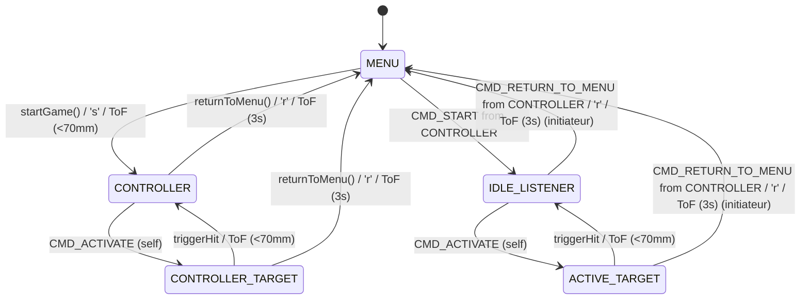

# Light Trainer - ESP32 Game System

## Project Overview

This project is an embedded multi-player game system for ESP32 microcontrollers. It uses ESP-NOW for communication, a VL53L0X distance sensor for player interaction, and WS2812B LEDs for visual feedback. The system supports various game modes and features a web-based configuration portal for easy setup of game parameters, which are persisted across reboots.

The architecture follows a master/slave pattern, where one device acts as a `CONTROLLER` (game master) and others as `IDLE_LISTENER`s or `ACTIVE_TARGET`s.

**Key Technologies:**
*   **Microcontroller:** ESP32 (e.g., ESP32-C3 XIAO)
*   **Wireless Communication:** ESP-NOW
*   **Sensor:** VL53L0X (Time-of-Flight distance sensor)
*   **Actuator:** WS2812B Addressable LEDs
*   **Development Framework:** Arduino
*   **Web Configuration:** Built-in web server for settings (using `WebServer.h` and `Preferences.h`)

## File Structure

The project is structured into logical modules for clarity and maintainability:

```
main/
├── main.ino          # Main Arduino file
├── Config.h          # Global configuration, enums, and structs
├── GameEngine.cpp    # Game logic and state machine implementation
├── GameEngine.h      # GameEngine class declaration
├── GameNetwork.cpp   # ESP-NOW communication implementation
├── GameNetwork.h     # GameNetwork class declaration
├── Hardware.cpp      # Hardware control (LEDs, Sensor) implementation
├── Hardware.h        # HardwareManager class declaration
├── WebConfig.cpp     # Web configuration portal implementation
├── WebConfig.h       # WebConfig class declaration
└── README.md         # Project documentation
```

## State Machine

The game logic is managed by a state machine. The possible states are:

-   **`MENU`**: Initial state, awaiting mode selection or game start.
-   **`CONTROLLER`**: Master pod, controls game flow.
-   **`CONTROLLER_TARGET`**: Master is an active target.
-   **`IDLE_LISTENER`**: Slave pod, awaiting activation.
-   **`ACTIVE_TARGET`**: Slave is an active target.

### State Diagram



## Game Modes

The system supports 4 game modes, defined in `GameEngine.h`:

1.  **Mode 0**: Primary Color: Green (`0x00FF00`), Secondary Color: Black (`0x000000`), No delay.
2.  **Mode 1**: Primary Color: Red (`0xFF0000`), Secondary Color: Green (`0x00FF00`), No delay.
3.  **Mode 2**: Primary Color: Blue (`0x0000FF`), Secondary Color: Black (`0x000000`), Random delay 0-10s.
4.  **Mode 3**: Primary Color: Yellow (`0xFFFF00`), Secondary Color: Magenta (`0xFF00FF`), Random delay 0-10s.

## Communication Protocol (ESP-NOW)

Communication is handled via ESP-NOW using a custom message structure.

### Message Types (`MsgType` enum)

-   `CMD_START`: Starts a game and communicates the mode color.
-   `CMD_ACTIVATE`: Activates a specific pod as a target.
-   `CMD_HIT`: Signals that a target has been hit.
-   `CMD_PING`: Used for network discovery.
-   `CMD_ACK`: Acknowledgment message.
-   `CMD_RETURN_TO_MENU`: Signals all pods to return to the `MENU` state.

### Message Structure (`struct_message`)

```cpp
typedef struct __attribute__((packed)) struct_message {
  uint32_t msgId;
  uint64_t senderID;
  uint64_t targetID;
  uint8_t msgType;
  uint8_t ttl;
  uint32_t color;
} struct_message;
```

## Input Handling & UX

### ToF Sensor Gestures (VL53L0X)

-   **Mode Selection (in `MENU` state):** Quick Tap (< 150mm, < 500ms) cycles through available modes (0 -> 1 -> 2 -> 3 -> 0).
-   **Start Game (in `MENU` state):** Hold hand (< 150mm) for 1.5 seconds. Circular LED gauge fills up and starts the game.
-   **Hit Target (in `ACTIVE_TARGET` or `CONTROLLER_TARGET` state):** Fast swipe or tap (< 150mm) instantly registers a hit with a 60ms white flash confirmation.
-   **Return to Menu (in any active game state):** Hold hand (< 150mm) for 3 seconds to reset all pods to the `MENU` state.

### Serial Commands & Debug Dashboard

-   `'s'`: Start the game (master only).
-   `'h'`: Simulate a hit.
-   `'0'-'3'`: Change game mode.
-   `'r'`: Return all pods to the `MENU` state.
-   `'d'`: Display the real-time Debug Dashboard.
-   `'?'`: Show serial command help.

## Key Features

*   **Modular Design:** Code is split into logical modules (`GameEngine`, `GameNetwork`, `Hardware`, `WebConfig`).
*   **Dynamic Role Assignment:** A device becomes `CONTROLLER` by starting the game; others become `IDLE_LISTENER`s.
*   **Distributed State Management:** All pods maintain their own state, synchronized via ESP-NOW broadcasts.
*   **Initial Light Synchronization:** At game start, all slave pods immediately light up with the selected game mode's color.
*   **Return to Menu:** A long press on the ToF sensor or the 'r' serial command can reset the entire system to the `MENU` state.
*   **Web Configuration:** A web portal allows for easy configuration of game parameters (though not modified in this session).