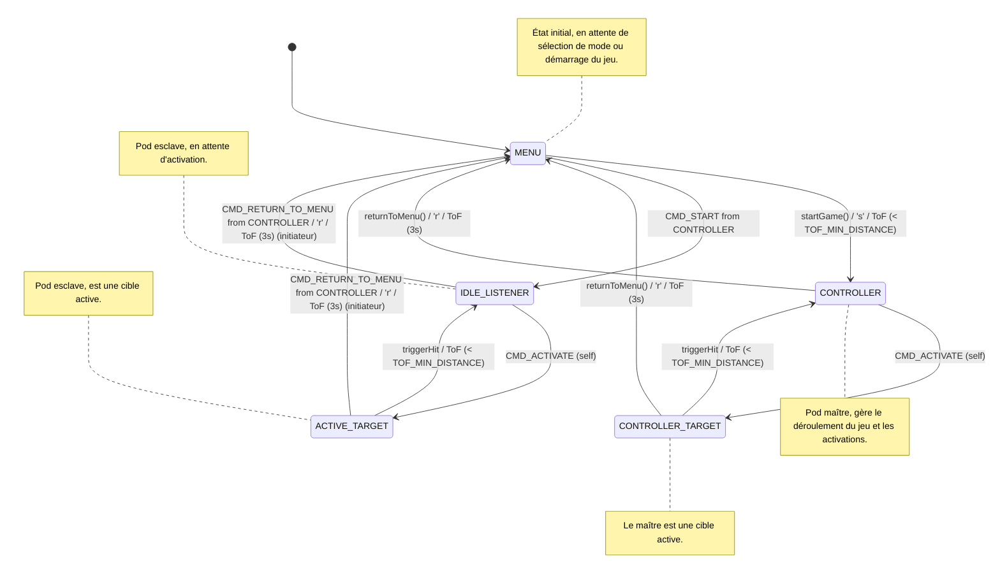

# Light Trainer - ESP32 Game System

Un système de jeu multi-joueurs utilisant ESP32 avec communication ESP-NOW, capteur de distance VL53L0X et LEDs WS2812B.

## Structure du Projet

```
main/
├── main.ino          # Fichier principal Arduino
├── Config.h          # Définitions de configuration globales
├── GameEngine.cpp    # Implémentation du moteur de jeu
├── GameEngine.h      # Déclarations du moteur de jeu
├── GameNetwork.cpp   # Implémentation de la logique réseau ESP-NOW
├── GameNetwork.h     # Déclarations de la logique réseau ESP-NOW
├── Hardware.cpp      # Implémentation de la gestion du matériel (LEDs, Capteur)
├── Hardware.h        # Déclarations de la gestion du matériel
├── WebConfig.cpp     # Implémentation du portail de configuration web
├── WebConfig.h       # Déclarations du portail de configuration web
└── README.md         # Ce fichier
```

## Matériel Requis

- **Seeed Studio XIAO ESP32-C3**
- **Capteur VL53L0X** (distance laser ToF I2C)
- **LEDs WS2812B** (ruban circulaire 7 LEDs)
- **Batterie LiPo 3.7V**
- **6 Résistances 100 kΩ** ($R_1$ à $R_6$)
- **1 Condensateur 100 nF** ($C_1$)
- **1 Interrupteur à glissière SPDT** ($SW_1$)

## Gestion de la Batterie & Recharge USB

Le système intègre une gestion complète de la batterie et de la recharge :

### Fonctionnalités

*   **Recharge USB-C automatique :** La batterie LiPo connectée aux pads `BAT+` / `GND` sous le XIAO est rechargée automatiquement dès le branchement du câble USB-C.
*   **Détection matérielle de Charge (D10) :** La broche `D10` est reliée au 5V `VBUS` via un pont $100\text{ k}\Omega / 200\text{ k}\Omega$ ($3.33\text{ V}$) pour détecter instantanément la connexion USB.
*   **Interrupteur ON/OFF & Veille Profonde (D2) :** L'interrupteur $SW_1$ coupe l'alimentation $3\text{V}3\_S$ du capteur/LEDs et bascule $D_2$ à LOW, mettant le XIAO en **Deep Sleep** ($\approx 10\,\mu\text{A}$). Le basculement sur ON réveille instantanément le système.
*   **Surveillance de la Tension (D1) :** Pont diviseur $100\text{ k}\Omega / 100\text{ k}\Omega$ avec condensateur de découplage $100\text{ nF}$ sur la broche ADC `D1`.
*   **Indication LED d'état :**
    *   **Orange :** Câble USB branché (Recharge en cours).
    *   **Rouge :** Batterie faible ($< 3.4\text{ V}$).
    *   **Veille de sécurité :** Coupure automatique si la batterie descend sous $3.0\text{ V}$.

## Configuration des Pins (Schéma V3 / Veroboard)

```cpp
#define LED_PIN     D7    // LEDs WS2812B Data (Broche 8)
#define SCL_PIN     D4    // I2C SCL VL53L0X (Broche 5)
#define SDA_PIN     D5    // I2C SDA VL53L0X (Broche 6)
#define SW_PIN      D2    // Interrupteur ON/OFF & Wake-up (Broche 3)
#define CHARGE_PIN  D10   // Détection Charge USB 5V (Broche 11)
#define BAT_ADC_PIN D1    // Mesure ADC Batterie (Broche 2)
#define BUZZER_PIN  D3    // Prévision Buzzer (Broche 4)
```

### Schéma de Câblage Veroboard

1. **Alimentation & Batterie :**
   * Pôle (+) de la batterie $\rightarrow$ Pad `BAT+` (Pin 21) du XIAO.
   * Pôle (-) de la batterie $\rightarrow$ Pad `GND` (Pin 22) du XIAO et masse commune `GND`.
2. **Interrupteur $SW_1$ :**
   * Broche 2 $\rightarrow$ `3V3_OUT` (Pin 12) du XIAO.
   * Broche 1 $\rightarrow$ Rail $3\text{V}3\_S$, relié à la broche `D2` et à la résistance pull-down $R_3$ ($100\text{ k}\Omega$ vers `GND`).
3. **LEDs WS2812B :**
   * `DIN` $\rightarrow$ Broche `D7` du XIAO.
   * `VDD` $\rightarrow$ Rail $3\text{V}3\_S$.
   * `GND` $\rightarrow$ `GND`.
4. **Capteur ToF VL53L0X :**
   * `VIN` $\rightarrow$ Rail $3\text{V}3\_S$.
   * `GND` $\rightarrow$ `GND`.
   * `SCL` $\rightarrow$ Broche `D4` du XIAO.
   * `SDA` $\rightarrow$ Broche `D5` du XIAO.
5. **Diviseur Batterie :**
   * $R_1$ ($100\text{ k}\Omega$) entre `BAT` et `D1`.
   * $R_2$ ($100\text{ k}\Omega$) et $C_1$ ($100\text{ nF}$) en parallèle entre `D1` et `GND`.
6. **Diviseur Détection USB (VBUS) :**
   * $R_4$ ($100\text{ k}\Omega$) entre `VBUS` (Pin 14) et `D10`.
   * $R_5 + R_6$ ($100\text{ k}\Omega + 100\text{ k}\Omega$) en série entre `D10` et `GND`.

## Modes de Jeu

Le système supporte 5 modes de jeu différents :

1.  **Mode 0**: Vitesse Solo — Couleur principale : Vert (`0x00FF00`), sans délai.
2.  **Mode 1**: Duel Bicolore — Joueur 1 : Rouge (`0xFF0000`), Joueur 2 : Vert (`0x00FF00`), sans délai (2 cibles actives en permanence).
3.  **Mode 2**: Réflexe Aléatoire — Couleur principale : Bleu (`0x0000FF`), délai aléatoire de 1 à 5s.
4.  **Mode 3**: Agilité Cognitive — C1 : Jaune (`0xFFFF00`), C2 : Magenta (`0xFF00FF`), délai aléatoire de 1 à 5s.
5.  **Mode 4**: Jeu Simon — Mémoire séquentielle & accélération progressive (rose de départ, couleurs signatures par pod).

## Configuration de Compilation (IDE Arduino)

> [!IMPORTANT]
> Dans le menu **Outils $\rightarrow$ Partition Scheme**, sélectionnez impérativement **`Huge APP (3MB No OTA/1MB SPIFFS)`**.
> Le microcontrôleur XIAO ESP32-C3 possède 4 Mo de mémoire Flash physique. La partition standard de 1.3 Mo est insuffisante pour le binaire incluant l'interface Web complète et provoque une erreur `Sketch too big`.

## Fonctionnalités Clés

*   **Initialisation des lumières en début de partie** : Au démarrage d'une partie, le pod maître éteint ses lumières. Les pods esclaves reçoivent la couleur du mode de jeu sélectionné et l'affichent immédiatement.
*   **Retour au menu via le capteur ToF** : Il est possible de revenir au menu principal à tout moment pendant le jeu en couvrant le capteur ToF (courte distance) pendant 3 secondes. Si un pod esclave déclenche cette action, il envoie un signal au pod maître, qui propage ensuite la commande à tous les autres pods pour réinitialiser le système en mode MENU.

## États du Système

- **MENU**: État initial, en attente de sélection de mode ou démarrage du jeu.
- **CONTROLLER**: Pod maître, gère le déroulement du jeu et les activations.
- **CONTROLLER_TARGET**: Le maître est une cible active.
- **ACTIVE_TARGET**: Pod esclave, est une cible active.
- **IDLE_LISTENER**: Pod esclave, en attente d'activation.

## Diagramme d'États



### Types de Messages

- `CMD_START`: Démarrage du jeu
- `CMD_ACTIVATE`: Activation d'une cible
- `CMD_HIT`: Cible touchée
- `CMD_PING`: Découverte des nœuds & mesure RTT/RSSI
- `CMD_ACK`: Accusé de réception ping
- `CMD_RETURN_TO_MENU`: Retour synchronisé au menu principal
- `CMD_MANUAL_SET`: Allumage forcé en mode manuel coach
- `CMD_TEST_LEDS`: Banc de test dynamique des LEDs
- `CMD_POD_TELEMETRY`: Télémétrie périodique batterie & charge USB
- `CMD_HEARTBEAT`: Battement de cœur régulier du Master (maintien du bail & synchro état)
- `CMD_CLAIM_MASTER`: Revendication du rôle Master (élection dynamique ou geste Hold 1.5s)

### Structure des Messages

```cpp
typedef struct __attribute__((packed)) struct_message {
  uint32_t msgId;     // Identifiant unique séquentiel
  uint64_t senderID;  // ID du pod expéditeur
  uint64_t targetID;  // ID de la cible (0 = broadcast à tous)
  uint8_t msgType;    // Type de message (CMD_*)
  uint8_t ttl;        // Nombre de sauts restants (Mesh multi-hop)
  uint32_t color;     // Couleur à afficher
} struct_message;
```

## Utilisation & Expérience Utilisateur (UX)

### Contrôles Gestuels par Capteur ToF (VL53L0X)

L'interaction repose sur des gestes numériques fiables et rapides, avec tolérance aux reflets et micro-coupures optiques :

- **Changer de Mode (en mode MENU) - *Tap Court*** :
  - Un passage bref de la main ($< 150\text{ mm}$ pendant moins de $500\text{ ms}$) fait défiler les modes (**Mode 0 $\rightarrow$ 1 $\rightarrow$ 2 $\rightarrow$ 3 $\rightarrow$ 0**).
  - Les 7 LEDs s'illuminent immédiatement de la couleur du mode sélectionné.
- **Lancer la Partie (en mode MENU) - *Maintien 1.5s (Hold)*** :
  - Maintenez la main au-dessus du pod ($< 150\text{ mm}$).
  - Les 7 LEDs affichent une **jauge circulaire de progression** qui se remplit. À $100\%$ ($1.5\text{ s}$), un flash blanc confirme le départ et le jeu commence.
- **Toucher une Cible (en Jeu) - *Hit Ultra-Rapide*** :
  - Tout passage rapide à $< 150\text{ mm}$ valide instantanément la touche avec un **flash blanc de confirmation ($60\text{ ms}$)**.
  - Le capteur tourne en mode `HIGH_SPEED` (50 Hz) pour garantir 0 latence.
- **Retour au Menu (depuis n'importe quel état) - *Maintien 3s*** :
  - Maintenez la main sur n'importe quel pod pendant $3\text{ secondes}$.
  - L'action réinitialise tous les pods du réseau en mode MENU de manière synchronisée.

### Contrôles Série

- `'s'`: Démarrer le jeu (le pod devient `CONTROLLER`)
- `'h'`: Simuler un hit
- `'0'-'3'`: Changer de mode de jeu (en mode `MENU`)
- `'r'`: Retour au menu principal
- `'d'`: Afficher immédiatement le Dashboard complet de débogage
- `'?'`: Afficher l'aide des commandes série

## Débogage Série Avancé (Dashboard)

Le système intègre un **tableau de bord ASCII temps réel** imprimé automatiquement toutes les 5 secondes (ou sur commande `'d'`) sur le port Série (115200 bauds) :

```text
+-----------------------------------------------------------------------+
|                     LIGHT TRAINER - DEBUG DASHBOARD                   |
+-----------------------------------------------------------------------+
| Pod ID           : 34:B7:DA:55:A1:2C (Dec: 57962454147372)
| Etat du Pod      : CONTROLLER (Master)
| Mode de Jeu      : Mode 1 (Duel - 2 Couleurs, sans delai)
| Parametres Mode  : C1=#FF0000, C2=#00FF00, Delai=[0ms - 0ms]
| Capteur ToF      : 115 mm [MAIN DETECTEE - Zone active <= 150mm]
| Pods Connectes   : 2 pod(s) decouvert(s)
|   [1] ID: E0:5A:1B:77:88:99 (Dec: 246675200379033)
|   [2] ID: F4:12:FA:11:22:33 (Dec: 268361099682355)
| Cibles Actives   : 1 cible(s) en cours
|   * Pod E0:5A:1B:77:88:99 | Couleur: #FF0000 | Activee depuis: 2.3s (Timeout: 15s)
| Dernier Msg RX   : CMD_HIT (msgId: 14, Emetteur: E0:5A:1B:77:88:99, Cible: 0 (BROADCAST), Couleur: #FF0000, Il y a 1s)
| Dernier Msg TX   : CMD_ACTIVATE (msgId: 15, Cible: E0:5A:1B:77:88:99, Couleur: #FF0000, Il y a 1s)
| Derniere Erreur  : Aucune erreur enregistree
| Uptime / RAM     : Uptime: 45s | Free Heap: 182340 octets
+-----------------------------------------------------------------------+
| Commandes Serie  : [s]=Start  [h]=Hit  [0-3]=Mode  [r]=Menu  [d]=Dashboard [?]=Aide
+-----------------------------------------------------------------------+
```

Vous pouvez également modifier la verbosité des logs en temps réel via `#define CURRENT_DEBUG_LEVEL` dans `Config.h` (`DEBUG_ERROR`, `DEBUG_INFO`, `DEBUG_VERBOSE`).