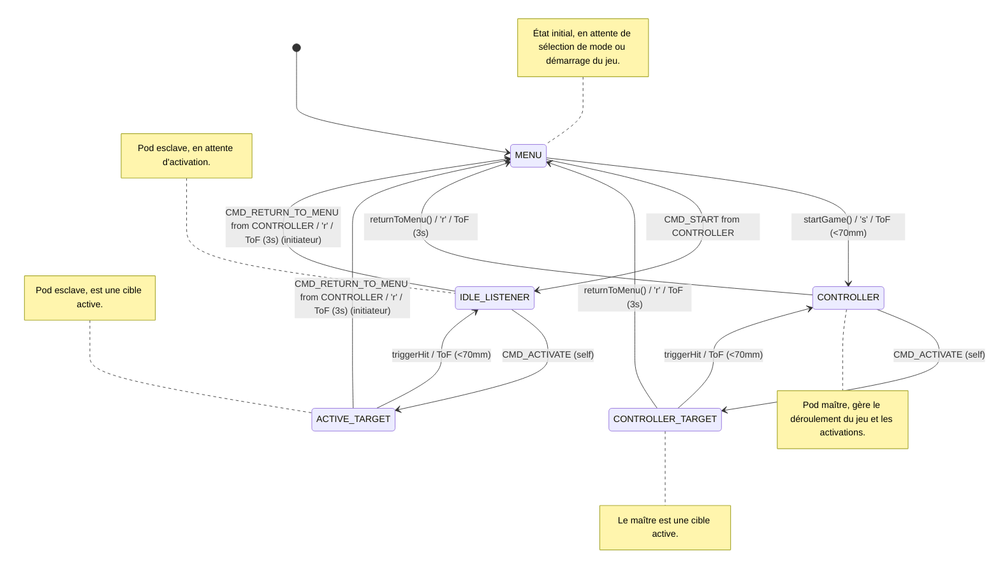

# Light Trainer - ESP32 Game System

Un système de jeu multi-joueurs utilisant ESP32 avec communication ESP-NOW, capteur de distance VL53L0X et LEDs WS2812B.

## Structure du Projet

```
main/
├── main.ino          # Fichier principal Arduino
├── Config.h          # Définitions de configuration globales
├── GameEngine.cpp    # Implémentation du moteur de jeu
├── GameEngine.h      # Déclarations du moteur de jeu
├── GameNetwork.cpp   # Implémentation de la logique réseau ESP-NOW
├── GameNetwork.h     # Déclarations de la logique réseau ESP-NOW
├── Hardware.cpp      # Implémentation de la gestion du matériel (LEDs, Capteur)
├── Hardware.h        # Déclarations de la gestion du matériel
├── WebConfig.cpp     # Implémentation du portail de configuration web
├── WebConfig.h       # Déclarations du portail de configuration web
└── README.md         # Ce fichier
```

## Matériel Requis

- **ESP32-C3 XIAO** (ou compatible ESP32)
- **Capteur VL53L0X** (distance laser)
- **LEDs WS2812B** (ruban ou matrice)
- **Batterie 3.7V**
- **2 Résistances XXk**

## Gestion de la Batterie

Le système intègre une gestion de la batterie pour surveiller l'état de charge et protéger la batterie.

### Fonctionnalités

*   **Surveillance de la Tension :** Utilise un diviseur de tension externe connecté à un pin ADC (GPIO21 / D6) de l'ESP32 pour mesurer la tension de la batterie.
*   **Indication LED :**
    *   **Orange :** La batterie est en charge (détectée par une augmentation de tension).
    *   **Rouge :** La batterie est faible (inférieure à 3.4V, environ 5%).
    *   **Verte :** La batterie est complètement chargée (4.2V).
    *   **Éteint :** La batterie a une charge suffisante mais n'est pas pleine.
*   **Protection Contre la Décharge Profonde :** Le système entre automatiquement en mode "Deep Sleep" si le niveau de la batterie tombe en dessous de 2% pour éviter une décharge excessive et protéger la durée de vie de la batterie.
*   **Activation/Désactivation :** La gestion de la batterie peut être activée ou désactivée via le drapeau `#define ENABLE_BATTERY_MANAGEMENT` dans `Config.h`.

### Configuration des Pins pour la Batterie (dans `Config.h`)

```cpp
#define BAT_ADC_PIN         D6    // GPIO21 pour la lecture de la tension de la batterie
```

## Configuration des Pins

```cpp
#define LED_PIN     D0  // LEDs WS2812B
#define SDA_PIN     D4  // I2C SDA pour VL53L0X
#define SCL_PIN     D5  // I2C SCL pour VL53L0X
```

### Schéma de Câblage (Conceptual)

Ce schéma décrit le raccordement des composants principaux. **Attention :** Ce n'est pas un diagramme Fritzing, mais une description textuelle des connexions.

**1. Alimentation Générale :**
*   Connectez le pôle négatif (GND) de la batterie LiPo au pin **GND** de l'ESP32-C3 XIAO.
*   Le pôle positif (+) de la batterie alimentera le circuit via un diviseur de tension pour la mesure.
*   Le 5V VBUS de l'USB (si utilisé pour l'alimentation ou la charge) se connecte aussi à l'ESP32.

**2. LEDs WS2812B :**
*   **Data Input (DIN) des LEDs**  ->  Pin **D0** de l'ESP32-C3 XIAO.
*   **VCC des LEDs**               ->  Pin **5V** de l'ESP32-C3 XIAO (si alimenté par USB ou batterie avec un régulateur 5V, ou directement à la batterie si les LEDs supportent la tension). *Assurez-vous que l'alimentation des LEDs est adéquate.*
*   **GND des LEDs**              ->  Pin **GND** de l'ESP32-C3 XIAO.

**3. Capteur de Distance VL53L0X :**
*   **SDA du Capteur** -> Pin **D4** (SDA) de l'ESP32-C3 XIAO.
*   **SCL du Capteur** -> Pin **D5** (SCL) de l'ESP32-C3 XIAO.
*   **VCC du Capteur** -> Pin **3V3** de l'ESP32-C3 XIAO.
*   **GND du Capteur** -> Pin **GND** de l'ESP32-C3 XIAO.

**4. Circuit de Mesure de la Tension de la Batterie (Diviseur de Tension) :**
*   Connectez le pôle positif (+) de votre batterie LiPo à une extrémité de la résistance **R1** (par exemple, 4.7kΩ).
*   Connectez l'autre extrémité de **R1** à une extrémité de la résistance **R2** (par exemple, 10kΩ) et également au pin **D6** de l'ESP32-C3 XIAO (configuré comme `BAT_ADC_PIN` dans `Config.h`).
*   Connectez l'autre extrémité de **R2** au pin **GND** de l'ESP32-C3 XIAO.
*   **Vérifiez bien les valeurs de vos résistances et le câblage pour ne pas endommager l'ESP32.**

## Modes de Jeu

Le système supporte 4 modes de jeu différents :

1.  **Mode 0**: Couleur principale : Vert (`0x00FF00`), sans délai.
2.  **Mode 1**: Couleur principale : Rouge (`0xFF0000`), Couleur secondaire : Vert (`0x00FF00`), sans délai.
3.  **Mode 2**: Couleur principale : Bleu (`0x0000FF`), délai aléatoire de 0 à 10s.
4.  **Mode 3**: Couleur principale : Jaune (`0xFFFF00`), Couleur secondaire : Magenta (`0xFF00FF`), délai aléatoire de 0 à 10s.

## Fonctionnalités Clés

*   **Initialisation des lumières en début de partie** : Au démarrage d'une partie, le pod maître éteint ses lumières. Les pods esclaves reçoivent la couleur du mode de jeu sélectionné et l'affichent immédiatement.
*   **Retour au menu via le capteur ToF** : Il est possible de revenir au menu principal à tout moment pendant le jeu en couvrant le capteur ToF (courte distance) pendant 3 secondes. Si un pod esclave déclenche cette action, il envoie un signal au pod maître, qui propage ensuite la commande à tous les autres pods pour réinitialiser le système en mode MENU.

## États du Système

- **MENU**: État initial, en attente de sélection de mode ou démarrage du jeu.
- **CONTROLLER**: Pod maître, gère le déroulement du jeu et les activations.
- **CONTROLLER_TARGET**: Le maître est une cible active.
- **ACTIVE_TARGET**: Pod esclave, est une cible active.
- **IDLE_LISTENER**: Pod esclave, en attente d'activation.

## Diagramme d'États



### Types de Messages

- `CMD_START`: Démarrage du jeu
- `CMD_ACTIVATE`: Activation d'une cible
- `CMD_HIT`: Cible touchée
- `CMD_PING`: Découverte des nœuds
- `CMD_ACK`: Accusé de réception
- `CMD_RETURN_TO_MENU`: Retour au menu principal

### Structure des Messages

```cpp
typedef struct struct_message {
  uint8_t msgType;    // Type de message
  uint32_t color;     // Couleur à afficher
  uint64_t targetID;  // ID de la cible
  uint64_t senderID;  // ID de l'expéditeur
} struct_message;
```

## Utilisation

### Contrôles par Capteur (VL53L0X)

- **Distance < 70mm**: Démarrer le jeu (en mode MENU)
- **Distance 70-200mm**: Changer de mode (en mode MENU)
- **Distance < 80mm**: Toucher la cible (quand allumé)
- **Distance < 70mm pendant 3 secondes**: Retour au menu principal (depuis n'importe quel état de jeu actif)

### Contrôles Série

- `'s'`: Démarrer le jeu
- `'h'`: Simuler un hit
- `'0'-'3'`: Changer de mode
- `'r'`: Retour au menu principale

## Compilation

1. Ouvrir `main.ino` dans Arduino IDE
2. Sélectionner la carte ESP32 appropriée
3. Installer les bibliothèques requises :
   - FastLED
   - Adafruit_VL53L0X
4. Compiler et téléverser

## Débogage

Le système fournit des messages série détaillés pour le débogage :
- États des capteurs
- Messages ESP-NOW reçus/envoyés
- Changements d'état
- Informations de découverte de nœuds

Vous pouvez modifier le niveau de debug en modifiant `#define CURRENT_DEBUG_LEVEL DEBUG_INFO` dans le fichier `config.h'.